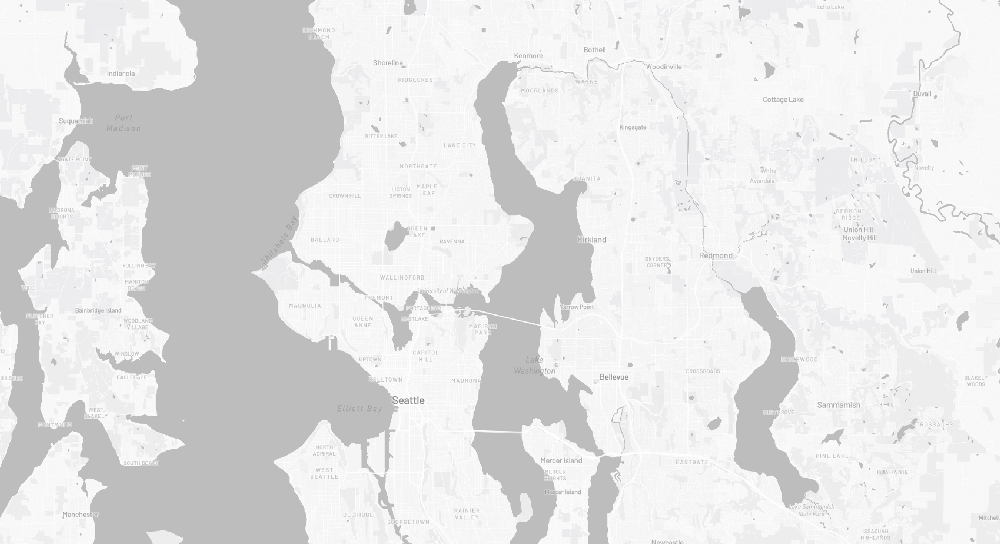
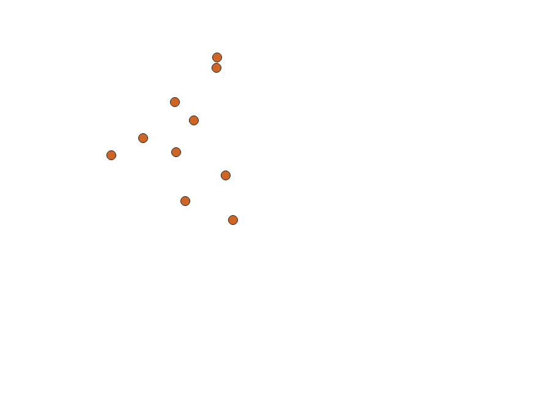
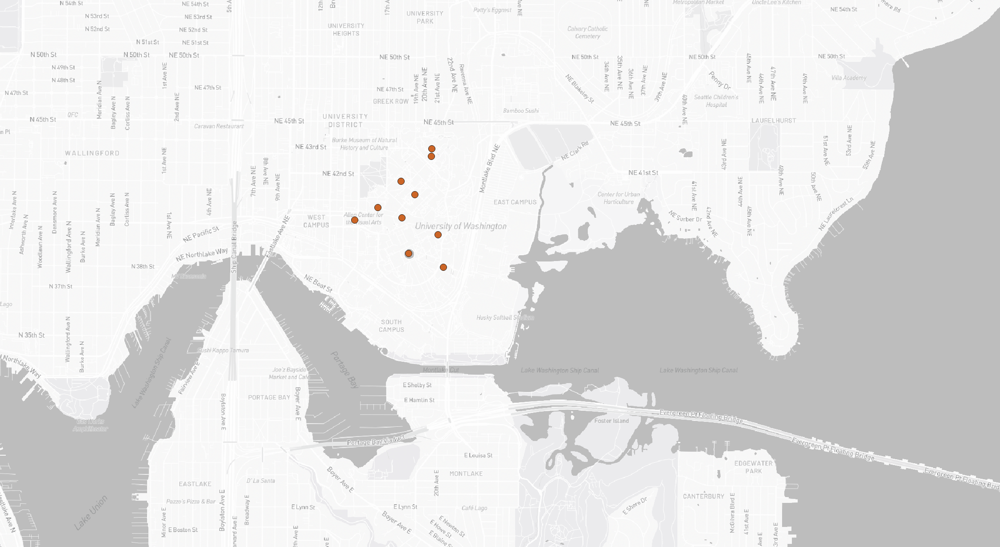
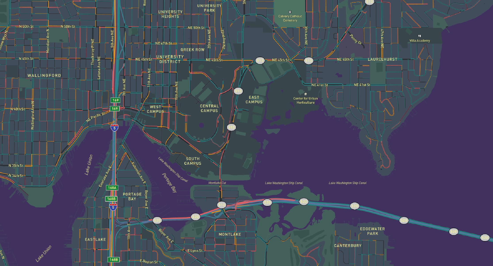

# Map-Design-and-Tile-Generation

## Examined Area and Detail About the Map
The area of focus for this project was the University of Washington Seattle Campus, and the popular spots are on campus. These locations tend to have a lot of foot traffic esecailly by students during the day, due to their usability and availability. We can see that the libraries, cafes, fields, and markets are among the most commonly visited locations. The zoom levels for each tile were 11 to 15, and the automatic zoom for the website was 12, which is within these ranges. The first tile is a basemap for our website, and it is in a monochrome Mapbox style. The second tile is the data points in which we are examining to see which areas students like to visit. The third tile is the combination of tile 2 on tile 1, so we can see the exact locations on the map rather than random points on a blank background. The fourth tile is the thematic map layer based on the colors of UW. It is the same as the first tile, but I changed the colors within Mapbox before converting it over into QGIS. The most noticable changes are the color of the water to purple and the color of the streets and city to gold to represent purple and gold.

## Link to Website Created
[Website](https://evanl105.github.io/Map-Design-and-Tile-Generation/)

## Images of the 4 tilesets

## NOTE
Files were too large to upload to Github so the tilesets are uploaded as zip files for download. A more detailed version of the map is visible once the zip files are unzipped and downloaded onto your devices, along with the index.html
